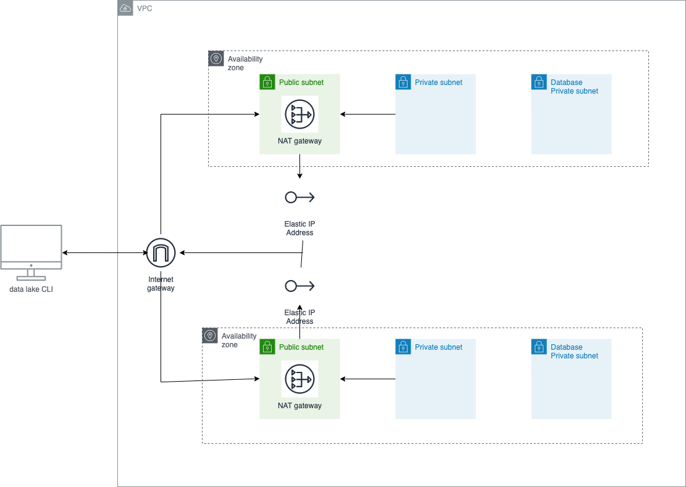

# Three-Tier AWS VPC Terraform-based

Example of a three-tier AWS VPC based on Terraform. 

It creates 22 resources:

- aws_db_subnet_group.database[0]
- aws_eip.nat[0]
- aws_internet_gateway.this[0]
- aws_nat_gateway.this[0]
- aws_route.private_nat_gateway[0]
- aws_route.public_internet_gateway[0]
- aws_route_table.database[0]
- aws_route_table.private[0]
- aws_route_table.public[0]
- aws_route_table_association.database[0]
- aws_route_table_association.database[1]
- aws_route_table_association.private[0]
- aws_route_table_association.private[1]
- aws_route_table_association.public[0]
- aws_route_table_association.public[1]
- aws_subnet.database[0]
- aws_subnet.database[1]
- aws_subnet.private[0]
- aws_subnet.private[1]
- aws_subnet.public[0]
- aws_subnet.public[1]
- aws_vpc.this[0]

